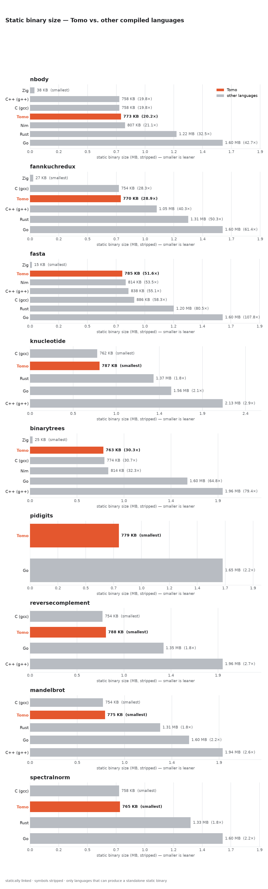

# Tomo benchmarks

Compare Tomo's performance against other languages using programs from
[The Computer Language Benchmarks Game][clbg] (CLBG).

Only the **Tomo** ports (`tomo/*.tm`) live in this repo. Every other language's
source is **downloaded on demand** into `fetched/`, which is git-ignored — so
this directory never vendors other languages' code. Most come from the CLBG
website; **Zig**, **Nim**, and **Odin** aren't covered by the CLBG, so they're
fetched from the community [Programming-Language-Benchmarks][plb] repo instead.

The PNG graphs below are a checked-in snapshot from one x86-64 Linux box (best
of 3 runs, each pinned to a single core, every output validated against the
reference). Timings are machine-specific — `results.json` and the vector
graphs are git-ignored; run the three commands below to reproduce everything
locally and regenerate these PNGs.


With the field now up to ~17 languages across all nine of the CLBG's
library-free benchmarks, the useful summary is that **Tomo sits inside the
compiled-language cluster and beats every scripting language on every single
benchmark, with no exceptions**. On the tight compute loops it lands in the
middle of that cluster: **fannkuch-redux** puts it at 0.35s, within 2.2× of the
fastest and jostling with Java, Fortran, and C; **n-body** at 0.56s is ~1.9×
the leader (Rust), just ahead of Go and Java. On the hash-table-heavy
**k-nucleotide** it takes 3rd at 0.28s — behind only C and C++, and ahead of
Go, LuaJIT, Java, Rust, and every scripting language. **binary-trees** (an
allocation/GC stress test) has it at 0.28s, mid-pack and ahead of Go, Odin,
and every scripting language. **fasta** is Tomo's softest core benchmark but
not an outlier — at 0.75s it's ~10× C (C's SIMD-friendly byte tables set an
unusually high bar here), still ahead of Java, C#, Rust, and every scripting
language.

Of the four newer benchmarks, **mandelbrot** is a standout: at 0.70s Tomo
*beats* the (multithreaded, core-pinned) C and Go entries outright, trailing
only Rust, C++, and Java. **reverse-complement** at 0.30s effectively ties
Python and Java, ahead of LuaJIT, JavaScript, C++, PyPy, and Lua. **spectral-
norm** at 1.16s is ~1.9× C, ahead of Go, C#, Java, and every scripting
language. **pidigits** — a pure GMP bignum stress test — is Tomo's weakest
relative showing at ~4.8× C, but still 4th of 9, comfortably ahead of Python,
PyPy, Java, C#, and JavaScript. Two runtime bugs surfaced (and got fixed)
while chasing these numbers down — see below.

The top of each compute chart is crowded with fast natives — Zig, Nim,
Fortran, and Rust routinely lead — but no garbage-collected, memory-safe
language in the set is dramatically ahead of Tomo, and the scripting languages
trail it everywhere, often by one or two orders of magnitude (Python is
50–300× slower than the fastest entry on several benchmarks here).

### Two runtime fixes this benchmark suite found

Timing **pidigits** turned up a genuine bug: every `Int` bignum's GMP limb
storage was allocated with GMP's default (plain `malloc`) allocator, so the
garbage collector never reclaimed it — a bignum-heavy loop leaked
continuously. Routing GMP's allocation hooks through the GC
(`mp_set_memory_functions`, set up once in `tomo_init`) fixed it: peak RSS on
pidigits (n=10000) dropped from **~11.3 GB to 12 MB**, and wall time from
6.75s to 1.75s, since the GC was no longer thrashing over gigabytes of leaked
limbs.

Profiling **reverse-complement** (which built its output with a per-byte
`out.insert(c)`) turned up a second one: `List$insert`'s growth path copied
the *entire* existing list one element at a time via a separate `memcpy()`
call per item, even when the data was already tightly packed and a single
bulk `memcpy` would do. `perf` showed a quarter of total runtime spent inside
those one-byte `memcpy` calls. Fixed to bulk-copy contiguous lists (the common
case, including every plain append-via-`insert`); this alone took reverse-
complement from 0.60s to 0.40s and improved k-nucleotide (which builds its
sequence the same way) too. It's a general fix — it speeds up any Tomo code
that builds a list via repeated `insert()`, not just these two benchmarks.

Even with that fix, `List$insert` still calls `memcpy()` once per element for
the actual item placement — real function-call overhead when the item is a
single byte. The reverse-complement port now avoids `insert()` entirely: its
output buffer is `data`'s own backing bytes, reused as scratch space by
slicing them (an O(1), zero-copy view) and writing into that slice by index.
The *first* indexed write triggers one bulk copy-on-write compact for the
whole buffer; every write after that is a plain bounds-checked pointer store,
no function call and no growth logic at all. That dropped reverse-complement
from 0.40s to **0.30s — tying Python**, whose entry does the equivalent
transform as two O(n) bulk C calls (`bytes.translate()` then
`bytearray.reverse()`) with zero per-byte interpreter overhead. Matching that
from a genuine scalar byte-loop, instead of losing to it the way even the
compiled C++ reference here does (0.89s), is about as good an outcome as a
safe, bounds-checked language can get without hand-vectorizing.

Per-benchmark graphs: [n-body](results-nbody.png) ·
[fannkuch-redux](results-fannkuchredux.png) · [fasta](results-fasta.png) ·
[k-nucleotide](results-knucleotide.png) ·
[binary-trees](results-binarytrees.png) · [pidigits](results-pidigits.png) ·
[reverse-complement](results-reversecomplement.png) ·
[mandelbrot](results-mandelbrot.png) ·
[spectral-norm](results-spectralnorm.png).

### Binary size

A companion comparison of **static binary sizes** — for the languages that can
produce a standalone statically-linked executable — is generated by
`bench.py sizes` and `plot.py --sizes`:



Every binary here is statically linked and stripped, so the number is the whole
self-contained footprint (code + language runtime), not a stub that leans on a
system `libc`. Tomo's binary is **~640 KB and near-constant across every
benchmark** — the runtime dominates and the program itself is noise — making it
the smallest self-contained binary after Zig's minimal-runtime musl builds, and
smaller than C, C++, Rust, Go, and Nim. (Interpreted and bytecode languages have
no such binary; Swift, Odin, and Fortran can't statically link on the test box;
and pidigits/spectral-norm's C/C++ drop out where static `libgmp`/`libgomp`
aren't installed.)

## Layout

```
benchmarks/
  config.json      # languages (build/run recipes) + per-benchmark program map
  bench.py         # driver: fetch / run / list
  fetch.sh         # thin wrapper: ./fetch.sh  ==  bench.py fetch
  plot.py          # results.json -> results.svg + results.png (or --sizes)
  tomo/            # TRACKED — the Tomo ports (the only source we own)
    nbody.tm
    fannkuchredux.tm
    fasta.tm
    knucleotide.tm
    binarytrees.tm
    pidigits.tm
    reversecomplement.tm
    mandelbrot.tm
    spectralnorm.tm
  fetched/         # git-ignored — reference implementations, downloaded
  .build/          # git-ignored — compiled binaries / build scratch
  results.json     # git-ignored — measured timings
  sizes.json       # git-ignored — measured static binary sizes
```

## Usage

```sh
./fetch.sh                 # download reference implementations for all benchmarks
python3 bench.py list      # show benchmarks + which toolchains are installed
python3 bench.py run       # build, run, validate, and time every language
python3 bench.py sizes     # build every language statically, record binary sizes
python3 plot.py            # render results.svg and results.png
python3 plot.py --sizes    # render sizes.svg and sizes.png from sizes.json
```

Environment overrides for quick iteration:

- `BENCH_ARGS="1000"` — override the benchmark input (e.g. a fast smoke test).
- `BENCH_REPEATS=1` — number of timed runs per language (best time is kept).
- `BENCH_BUILD_TIMEOUT=180` — per-language build timeout in seconds.
- `BENCH_CPU=2` — which core to pin runs to (default `0`); `BENCH_CPU=all`
  disables pinning.

## How a run works

For each benchmark, the **reference** language (C) runs first and its output
becomes the expected result. Every other language must reproduce that output
byte-for-byte or it is flagged as an output mismatch (a program can't post a
fast time by computing the wrong thing). Each language is run `repeats` times
and the best wall-clock time is kept, along with peak RSS.

**Every timed run is pinned to a single core** (`taskset -c 0`). Several CLBG
programs are multithreaded — fannkuch-redux's `go-1` hardcodes
`runtime.GOMAXPROCS(4)`, `gpp-1` fans out with `std::async`, and the Rust and
Java entries spawn threads — while the C reference and the Tomo ports are
single-threaded. Unpinned, the wall-clock chart would compare 1-core programs
against N-core ones; pinned, it's a same-resources, language-vs-language
comparison.

## Ground rules for the Tomo ports

- **No inline C for computation.** The Tomo ports implement the actual
  algorithm in pure Tomo. The *only* permitted `C_code` use is formatting the
  final numeric output with `printf` (Tomo has no `%.9f`-style zero-padded
  float formatting), matching the benchmark's required output exactly.
- Ports use the same algorithm as the reference programs, sized by the same
  input, and validated against the reference output.

## Languages

| Status | Languages |
|--------|-----------|
| Active | C (gcc), C++ (g++), Rust, Go, Zig, Nim, Odin, Java, C#, Swift, Fortran, JavaScript (node), Lua, LuaJIT, Python, PyPy, **Tomo** |

Not every language implements every benchmark. A language runs only the
benchmarks it has a validated program for; the rest are simply absent from that
chart. Coverage gaps (and why they exist) are noted below.

C# uses **Native AOT** (`dotnet publish` with `PublishAot`), matching the
CLBG `csharpaot` entries: the driver writes a minimal AOT `.csproj`, drops the
fetched source in as `Program.cs`, and runs the resulting standalone native
binary — a fair peer to the other compiled languages, with none of the JIT/
runtime startup a `dotnet foo.dll` launch adds to every short run. It needs the
.NET SDK plus `clang` (for the final native link); machines without both are
skipped. The first AOT build restores the ILCompiler package from NuGet, so it
needs network access once.

Swift is compiled ahead-of-time with `swiftc -O`. A few CLBG Swift entries are
too old for a current toolchain (Swift 6.x) or skip the benchmark's required
output format, so the slugs are chosen to avoid those: **n-body** uses
`swift-3` (`swift-1` prints unformatted doubles instead of `%.9f`) and
**k-nucleotide** uses `swift-2` (`swift-1` calls the long-removed
`String.characters`).

Fortran is compiled with `gfortran -O3 -march=native`. It runs in four of the
five benchmarks; CLBG has no Fortran k-nucleotide entry (the page is a stub
noting the lack of a standard Fortran hash table), so it's skipped there.

Zig, Nim, and Odin are the non-CLBG languages: their sources come from the
community [Programming-Language-Benchmarks][plb] repo (raw files, not
HTML-extracted — see `source: "plb"` in `config.json`), and a program's slug is
just the repo's filename stem (e.g. `"2"` → `2.nim`).

- **Zig** builds with `zig build-exe -OReleaseFast -lc`. Those sources target
  Zig ~0.14 (before the 0.15 `std.io`/`process.args` rework), so the driver
  prefers a `zig0.14` binary on PATH (override with `ZIG=...`); a bleeding-edge
  `zig` alone won't compile them. Runs four of five — its k-nucleotide entry
  reads an input *file path* rather than stdin, which doesn't fit the
  `stdin_fasta` harness.
- **Nim** builds with `nim c -d:danger`. The repo has Nim for n-body,
  binary-trees, and fasta only (three of five) — no fannkuch or k-nucleotide
  entry exists to fetch.
- **Odin** builds with `odin build -o:speed`. The repo has Odin for n-body,
  binary-trees, and k-nucleotide, but the k-nucleotide entry doesn't compile on
  a current Odin (`os.stream_from_handle` was removed), leaving two of five.

The PLB benchmark directory names differ slightly from ours
(`fannkuch-redux` vs `fannkuchredux`); `bench.py`'s `PLB_ALGO` maps between
them.

A language with no installed toolchain is skipped with a message rather than
failing the run.

## Benchmarks

Implemented — all nine of the CLBG's library-free core: **n-body**,
**fannkuch-redux**, **fasta**, **k-nucleotide**, **binary-trees**,
**pidigits**, **reverse-complement**, **mandelbrot**, **spectral-norm**.
(regex-redux is deliberately excluded: it benchmarks a regex library, not the
language.)

**pidigits** is a pure big-integer benchmark (a streaming spigot for the digits
of π). It maps directly onto Tomo's default `Int`, which is a GMP-backed
arbitrary-precision integer, so the port is a near-transliteration of the C
reference. Peers use each language's standard bignum (GMP for C/C++ via `-lgmp`,
Go's `math/big`, native `BigInt`/`BigInteger`, Python's native `int`). Rust is
omitted — every CLBG Rust entry links the `rug`/`ramp` GMP-binding crates, none
vendored here.

**reverse-complement** slurps a FASTA file on stdin (same `stdin_fasta` harness
as k-nucleotide) and reverse-complements each sequence. The C serves it under
the short URL stem `revcomp`, so its config carries `site_name: "revcomp"`. Rust
is omitted — every CLBG Rust entry depends on the `rayon` crate.

**mandelbrot** renders the set as a P4 PBM bitmap. Its C/C++ references are
built with an extra `-ffp-contract=off` (per-benchmark `cflags`): under
`-march=native`, gcc otherwise contracts the complex-square update into fused
multiply-adds, which flips a single boundary pixel (`c = -i`) and diverges from
the byte-exact output that Python, Go, Rust, and the Tomo port all agree on.

**spectral-norm** is a dense floating-point benchmark (the power method on
AᵀA). Its C++ entry needs `-fopenmp` (`cflags`); Python uses the single-threaded
`python3-6` because the default entry's multiprocessing pool thrashes badly when
pinned to one core; Swift is omitted because current `swiftc` can't type-check
the fetched `eval_A` expression in reasonable time.

**k-nucleotide** reads a FASTA file on stdin: the driver generates that input
with the C fasta program at the configured scale and pipes it to each
implementation (see `stdin_fasta` in `config.json`). The C entry depends on
klib's `khash.h`; the benchmark's `cflags` adds `-I/usr/include/klib`, so C is
skipped on machines where klib isn't installed there. Its Java entry uses
`graalvmaot-3` (the `-1`/`-2` entries need the external `fastutil` library).

PyPy runs the same fetched sources as CPython (`source_from: "python"`), via
`pypy3` — so it needs a Python **3** PyPy (the `pypy` 2.7 binary won't run the
Python-3 entries). It covers every benchmark.

LuaJIT runs the same fetched source as Lua. LuaJIT is Lua 5.1, and a few CLBG
Lua entries call 5.2+ names (e.g. `table.unpack` in the fasta entry), so the
`luajit` config carries a one-line `prelude` — `if not table.unpack then
table.unpack=unpack end` — run via `luajit -e` before the script. That shims
the 5.1/5.2 gap without editing the fetched source, so Lua and LuaJIT run
byte-identical programs. (k-nucleotide's Lua entry needs no shim; it just
hadn't been wired up for LuaJIT before.)

Rust is omitted from **binary-trees**: every CLBG Rust entry links an external
arena crate (`typed_arena`, `bumpalo`) and/or `rayon`, none vendored here. The
C++ entry (`gpp-2`) is the self-contained one; the faster `gpp-1`/`gpp-3` need
Boost.Pool. Tomo uses its own GC and heap pointers, no arena — a node is a
self-referential struct with two optional `@Tree?` children.

C# is omitted from **k-nucleotide**: its CLBG entries depend on the external
`Microsoft.Collections.DictionarySlim` NuGet package (much like the Java
entries there need `fastutil`), which isn't vendored here.

[clbg]: https://benchmarksgame-team.pages.debian.net/benchmarksgame/
[plb]: https://github.com/hanabi1224/Programming-Language-Benchmarks
